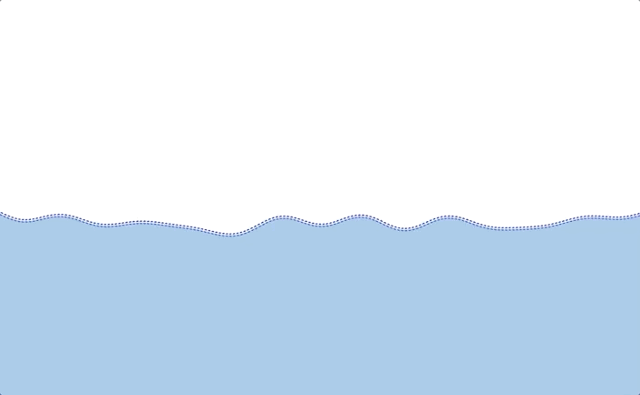

# Waves

This app models waves in spritekit.

The background waves are stacked random sine waves.

The splash waves are computed useing hooks law: https://gamedevelopment.tutsplus.com/tutorials/make-a-splash-with-dynamic-2d-water-effects--gamedev-236

